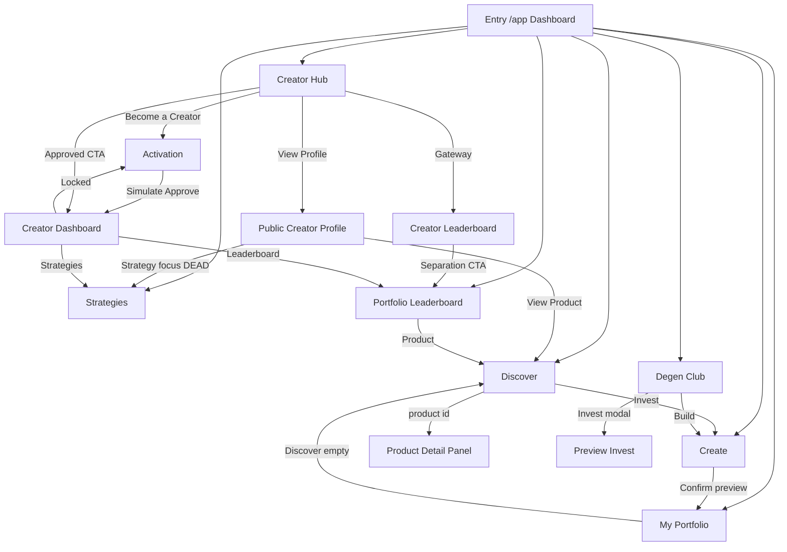

# INDEXLA App — Design Freeze Audit (Phase 4E)

**Status:** Read-only audit for founder review — **no application code changes, no commit, no push, no deploy.**  
**Date:** 2026-08-23  
**Repo:** `IndexLa-App` (`https://github.com/IdeatorYas/IndexlaApp`)  
**Live preview audited:** `https://app.indexla.tech`  
**Authority:** `content/app/INDEXLA_APP_V1_BUILD_PLAN.md` (website repo)  
**Scope boundary:** Preview UI only. Wallets, contracts, testnet, backend, live execution and blockchain integrations are **out of scope** and must not start from this audit.

---

## 1. Route inventory

| # | Screen | Route | In sidebar? | Primary View |
|---|--------|-------|-------------|--------------|
| 1 | Marketplace-First Dashboard | `/app` | Yes — Dashboard | `DashboardView` |
| 2 | Discover (+ product detail) | `/app/discover` (`?id=`, `?tab=`, `?q=`, `?filter=`) | Yes — Discover | `DiscoverView` + `ProductDetailPanel` |
| 3 | Create Portfolio / Index | `/app/create` (`?template=degen`, `?from=`) | Yes — Create Portfolio | `CreateWizard` |
| 4 | My Portfolio | `/app/portfolio` (`?tab=`, `?selected=`) | Yes — My Portfolio | `MyPortfolioView` |
| 5 | Strategies | `/app/strategies` (`?tab=marketplace\|mine\|publish`) | Yes — Strategies | `StrategiesView` |
| 6 | Portfolio Leaderboard | `/app/leaderboard` (`?period=`) | Yes — Leaderboard | `LeaderboardView` |
| 7 | Degen Club (+ detail) | `/app/degen-club` (`?id=`) | Yes — Degen Club | `DegenClubView` |
| 8 | Creator Hub | `/app/creators` | Yes — Creators | `CreatorsHubView` |
| 9 | Creator Leaderboard | `/app/creators/leaderboard` | No (hub gateway) | `CreatorLeaderboardView` |
| 10 | Public Creator Profile | `/app/creators/{handle}` | No | `CreatorProfileView` |
| 11 | Creator Activation | `/app/creators/activate` | No (hub gateway) | `CreatorActivationView` |
| 12 | Creator Dashboard | `/app/creator-dashboard` | No (approved only) | `CreatorDashboardView` |

**Global shell (all screens):** `AppShell` → `PreviewBanner` + `AppHeader` + `AppSidebar`  
**Theme:** `data-theme` light/dark via `ThemeProvider` (`indexla-app-theme` localStorage; default dark)

**Not in sidebar (by design):** Creator Leaderboard, Activation, Profile, Creator Dashboard — reached from Creator Hub / Activation / approved state.

---

## 2. Screen-by-screen findings

### 2.1 Dashboard `/app`
- **Structure:** Marketplace hero → Featured → Explore Marketplace → Product Pathways → How INDEXLA Works → Personal Snapshot (secondary) → trust strip.
- **Hierarchy:** Marketplace-first is clear; personal data correctly secondary.
- **Issues:** Personal Snapshot “Claim Rewards” deep-links to `/app/portfolio?action=claim` but My Portfolio **ignores** `action=claim`. Orphan section components exist in repo but are **not mounted** (dead code, not dead UI).
- **States:** Personal Snapshot disconnected / loading / error; marketplace always populated.
- **Illustrative:** Featured + snapshot badges present; global Preview banner present.
- **Responsive:** Hero + pathways wrap; acceptable for freeze review.

### 2.2 Discover `/app/discover`
- **Structure:** Filters → product grid → optional `ProductDetailPanel` when `?id=`.
- **Strengths:** Solid Index/Portfolio tabs; Invest routes into Create; Like/Follow/Tip/Share preview-gated.
- **Issues:** Product detail pattern differs from Degen Club (panel vs custom detail) — shared-component inconsistency for freeze polish.
- **States:** Loading, error, empty (+ clear filters), soft disconnected.

### 2.3 Create `/app/create`
- **Structure:** Step rail Product → Category (Index only) → Assets → Strategy → Details → Review.
- **Strengths:** Clear Index vs Portfolio choice; degen template risk banner; disabled execution disclosures.
- **Issues:** CTA naming sometimes “Create Portfolio” only (sidebar + empty states) while screen is “Create Portfolio / Index”.
- **States:** Draft hydration loading; review Connect Wallet; confirm/authorize are preview-only (intentional).

### 2.4 My Portfolio `/app/portfolio`
- **Structure:** Portfolio selector → Overview / Assets / Automation / Activity / Notifications.
- **Strengths:** Hard disconnected gate; $DEXLA Save shown separately from USD; Illustrative on activity.
- **Critical:** Sidebar **Buy $DEXLA** → `/app/portfolio?action=buy-dexla` is a **dead deep link** (param unused). Same class of bug for `?action=claim` / `add-funds`.
- **States:** Disconnected, loading, error, empty portfolios.

### 2.5 Strategies `/app/strategies`
- **Structure:** Marketplace | My Strategies | Publish + always-visible `UtilityGateState` for Private Strategy Payments.
- **Strengths:** Strong preview / $DEXLA fee & burn messaging.
- **Issues:** Creator Profile strategy links use `?focus=` which Strategies **does not read**. Utility gate always on can feel noisy vs other screens that only toast “preview only”.
- **States:** Loading, error, empty marketplace/mine, soft disconnected.

### 2.6 Portfolio Leaderboard `/app/leaderboard`
- **Structure:** Period (Monthly/All-Time) → filters → podium → Winner Zone → Competing → Rewards (monthly).
- **Strengths:** Explicit “ranks products, not creators”; Index/Portfolio filter; engagement ≠ ranking copy.
- **Watch:** “Creator Rewards Pool” naming is correct for creators of winning **products** but easy to confuse with Creator Leaderboard — keep separation callouts during freeze redesign.
- **States:** Loading, error, empty, filtered empty, soft disconnected.

### 2.7 Degen Club `/app/degen-club`
- **Structure:** Extreme-risk banner → hero (1-shot vs 10-shots) → discover grid → product detail → Build/Invest modals.
- **Strengths:** Persistent risk messaging; Invest confirmation modal; Create degen template path.
- **Issues:** Detail UI not shared with Discover `ProductDetailPanel`; likes/follows preview only.
- **States:** Loading, error, empty, filter empty, soft disconnected.

### 2.8 Creator Hub `/app/creators`
- **Structure:** Status smart card → search/filters → Featured → directory.
- **Strengths:** Status lifecycle (locked → in-progress → awaiting → needs-changes → approved); Dashboard unlocks only when approved; required activation copy present.
- **Issues:** Demo status pills (illustrative) can override visual card status without writing activation storage — fine for demo, confusing if mistaken for real progress.
- **States:** Loading, error, empty, search empty, soft disconnected.

### 2.9 Creator Leaderboard `/app/creators/leaderboard`
- **Structure:** Separation callout → filters → Top 3 → rankings table → link to Portfolio Leaderboard.
- **Strengths:** Clear non-reward / non-Portfolio-LB framing; View Profile links.
- **Issue:** Not in sidebar — discoverability depends on Hub gateway (acceptable if intentional).

### 2.10 Public Creator Profile `/app/creators/{handle}`
- **Structure:** Identity → metrics → Public products → Published strategies → Analytics → Activity → Disclosure → Tip modal.
- **Strengths:** Funds disclosure; per-product Portfolio LB ranks; engagement ≠ ranking.
- **Issues:** Strategy “View” deep-link `?focus=` dead on Strategies. Client loading gate delays SSR content (curl sees skeleton; Playwright sees full UI after hydrate).
- **States:** Loading, error, empty products, not-found, soft disconnected, stale banner.

### 2.11 Creator Activation `/app/creators/activate`
- **Structure:** Four steps — Public Portfolio → Social → Verification → Approved.
- **Strengths:** Required copy; personal portfolios marked ineligible; local persistence; preview OAuth/submit/approve.
- **Issues:** Approval is local simulate only (intentional for preview). Social LinkedIn not on older `CreatorSocialLink` domain union but present in activation UI (OK).
- **States:** Loading, error, no-public-portfolio, soft disconnected.

### 2.12 Creator Dashboard `/app/creator-dashboard`
- **Structure (approved):** Identity → Overview → Earnings (USD | $DEXLA) → Live products → Audience → Portfolio LB position → My Strategies → Activity.
- **Locked:** EmptyState + Continue Creator Setup → Activation.
- **Strengths:** USD/$DEXLA never combined; Feature Portfolio confirm (2,500 · 7 days · 100% burn) feature-flagged; per-product LB ranks.
- **Issues:** Feature gate UX differs from Strategies (confirm + UtilityGate nested). Multiple Claim Rewards/Revenue buttons with identical preview toasts — workable but dense.
- **States:** Checking/loading, error, locked, disconnected, empty products/earnings/strategies/activity.

---

## 3. Complete button / action destination matrix

### Global shell
| Control | Destination / behavior |
|---------|------------------------|
| Logo / INDEXLA | `/app` |
| Sidebar NAV_ITEMS | Respective `APP_ROUTES` |
| Buy $DEXLA | `/app/portfolio?action=buy-dexla` — **DEAD PARAM** |
| Header search | GET `/app/discover?q=` |
| Header Connect Wallet | Demo connect / disconnect |
| Header notifications | `/app/portfolio?tab=notifications` — **works** |
| Header ⌘K affordance | Decorative (`pointer-events-none`) — **dead** |
| Theme toggle | Light/dark |

### Dashboard
| Control | Destination / behavior |
|---------|------------------------|
| Explore Marketplace | `/app/discover` (+ optional tab) |
| Create Portfolio / Index | `/app/create` |
| Featured / row cards | `product.href` → Discover `?id=` |
| Pathways | Create / Degen / Strategies / Leaderboard / Creators |
| Open My Portfolio | `/app/portfolio` |
| Manage Automations | `/app/portfolio?tab=automation` |
| Claim Rewards | `/app/portfolio?action=claim` — **DEAD PARAM** |

### Discover
| Control | Destination / behavior |
|---------|------------------------|
| Create | `/app/create` |
| Product open | `?id=` panel |
| Invest / Customize & Invest | `/app/create?from=` (+ `mode=customize`) |
| Follow / Notify / Tip / Like / Share | Preview only |

### Create
| Control | Destination / behavior |
|---------|------------------------|
| Confirm Initial Purchase / Authorize Automation | Preview only |
| View Portfolio / Index | `/app/portfolio` |
| Degen template | Prefill + risk banner |

### My Portfolio
| Control | Destination / behavior |
|---------|------------------------|
| Discover / Create (empty) | `/app/discover`, `/app/create` |
| Claim Rewards / trade / automation / export | Preview only |
| Tabs | `?tab=` Overview/Assets/Automation/Activity/Notifications |

### Strategies
| Control | Destination / behavior |
|---------|------------------------|
| Marketplace actions | Preview (purchase flag-gated) |
| Use in Create | `/app/create` |
| Claim Revenue / Edit / Pause / Publish | Preview |
| Tabs | `?tab=marketplace\|mine\|publish` |
| `?focus=` from profile | **IGNORED** |

### Portfolio Leaderboard
| Control | Destination / behavior |
|---------|------------------------|
| Period | `?period=monthly\|all-time` |
| Product links | Discover `?id=` |
| View Reward Details / Claim Rewards | Preview |

### Degen Club
| Control | Destination / behavior |
|---------|------------------------|
| Build Your Own | Modal → `/app/create?template=degen` |
| Product | `?id=` detail |
| Invest | Confirm modal → preview |
| Follow / Like | Preview |

### Creator Hub
| Control | Destination / behavior |
|---------|------------------------|
| Become a Creator / Continue / View Activation | `/app/creators/activate` |
| Open Creator Dashboard | `/app/creator-dashboard` (approved) |
| Creator Leaderboard | `/app/creators/leaderboard` |
| View Profile | `/app/creators/{handle}` |
| Follow / Notify | Preview |

### Creator Leaderboard
| Control | Destination / behavior |
|---------|------------------------|
| View Portfolio Leaderboard | `/app/leaderboard` |
| View Profile | `/app/creators/{handle}` |

### Public Creator Profile
| Control | Destination / behavior |
|---------|------------------------|
| Follow / Notify / Tip / Share / Like / Invest | Preview |
| View Product | Discover `?id=` |
| View Strategy | Strategies `?focus=` — **DEAD** |
| Not found | Browse Creators |

### Creator Activation
| Control | Destination / behavior |
|---------|------------------------|
| Create & Publish Portfolio | `/app/create` |
| Connect / Disconnect socials | Preview local state |
| Submit / Simulate Approve / Needs Changes | Preview local state |
| Open Creator Dashboard | `/app/creator-dashboard` |
| View Public Profile | `/app/creators/{handle}` |
| Publish Strategy | `/app/strategies?tab=publish` |

### Creator Dashboard
| Control | Destination / behavior |
|---------|------------------------|
| Continue Creator Setup (locked) | `/app/creators/activate` |
| View Public Profile | `/app/creators/{handle}` |
| Share / Claim / Feature / History | Preview (Feature flag-gated) |
| View Product | `product.href` |
| View Full Portfolio Leaderboard | `/app/leaderboard` |
| View My Strategies / Publish | Strategies `?tab=mine\|publish` |
| Create Portfolio (no products) | `/app/create` |

---

## 4. User-flow map

**Primary investor journey:** Dashboard → Discover/Degen → Create → My Portfolio → Leaderboard/Strategies.  
**Primary creator journey:** Creators Hub → Activation → (approve) Creator Dashboard → Profile / Strategies / Portfolio LB.  
**Separation rule:** Portfolio Leaderboard ranks **products**; Creator Leaderboard ranks **creators** (discovery only, no monthly rewards).

---

## 5. Critical issues

| ID | Severity | Issue | Recommendation |
|----|----------|-------|----------------|
| C1 | **High** | `?action=buy-dexla` and `?action=claim` deep links are dead | Either implement handlers or remove/relabel CTAs before freeze |
| C2 | **High** | Creator Profile strategy `?focus=` ignored by Strategies | Wire focus scroll/open or change href to marketplace search |
| C3 | **Medium** | Header ⌘K control is non-interactive | Remove or implement command palette |
| C4 | **Medium** | Discover vs Degen product detail implementations diverge | Unify on one Product Detail pattern in design freeze |
| C5 | **Medium** | “Create Portfolio” vs “Create Portfolio / Index” naming drift | Standardize nav + empty CTAs |
| C6 | **Medium** | Illustrative badge styling inconsistent (pill styles differ) | One `IllustrativeBadge` everywhere |
| C7 | **Low** | Orphan dashboard section files not mounted | Delete or rewire in cleanup pass (not user-facing) |
| C8 | **Low** | ScreenStub component unused | Remove in cleanup |
| C9 | **Low** | Hub demo status pills vs localStorage activation can disagree | Label demo pills “UI preview only” or sync storage |
| C10 | **Info** | Nearly all money actions are preview toasts | Keep; ensure freeze redesign preserves safety copy |

---

## 6. Visual inconsistencies

1. **Illustrative labeling:** mix of warning pills, muted chips, `IllustrativeBadge`, and section title suffixes (`· Illustrative`).
2. **Product cards:** Dashboard featured rows ≠ Discover `MarketplaceProductCard` ≠ Degen cards ≠ Creator product cards.
3. **Detail surfaces:** Discover side/overlay panel vs Degen full detail section vs Create review.
4. **UtilityGate visibility:** Always-on Strategies gate vs nested Feature Portfolio gate vs toast-only claims elsewhere.
5. **Metric grids:** Slightly different label casing/density across Profile, Hub, Dashboard, Leaderboard.
6. **Empty states:** Consistent component, but CTA label wording varies (“Create Portfolio” vs “Create Portfolio / Index”).
7. **Light theme:** Tokens exist; default dark means light is less battle-tested visually — screenshots included for founder review.
8. **Mobile:** Sidebar drawer + stacked filters OK; dense Creator Dashboard / Earnings tabs need freeze spacing pass.

---

## 7. Missing / duplicated controls

### Missing or incomplete
- Working Buy $DEXLA destination (sidebar)
- Working Claim deep-link from Dashboard Personal Snapshot
- Strategies focus/deep-link from Creator Profile
- Command palette behind ⌘K chrome
- Sidebar entries for Creator Leaderboard / Activation (optional — may stay hub-gated)
- Unified Product Detail for Discover + Degen

### Duplicated / dense
- Multiple “Claim Rewards” / “Claim Revenue” buttons with same preview behavior (Portfolio, Leaderboard, Strategies, Creator Dashboard)
- Follow / Notify / Like patterns reimplemented per screen with similar preview toasts
- “Connect Wallet” banners repeated (good for safety, visually repetitive)

### Intentionally absent (do not add in freeze without product decision)
- Real OAuth, custody, signing, on-chain execution
- Combined USD+$DEXLA totals
- Combined creator-level Portfolio Leaderboard rank
- Follower-count / founding-creator activation gates

---

## 8. Recommended design-freeze order

1. **Navigation & deep-link hygiene** — fix or remove dead `action=` / `focus=` / ⌘K (C1–C3).
2. **Terminology pass** — Index vs Portfolio; Portfolio LB vs Creator LB; Create naming (C5).
3. **Illustrative + Preview safety system** — one badge, one preview toast pattern, keep global banner (C6, C10).
4. **Shared product surfaces** — unify Product Card + Product Detail (Discover/Degen/Dashboard) (C4).
5. **Creator suite polish** — Hub/Activation/Profile/Dashboard spacing, status clarity, Feature confirm UX (C9).
6. **Earnings & $DEXLA presentation** — reinforce separate ledgers everywhere tips/claims appear.
7. **Responsive densification** — Creator Dashboard, Strategies filters, Leaderboard tables on mobile.
8. **Accessibility/readability** — heading hierarchy, contrast on light theme, focus states, modal labels.
9. **Dead-code cleanup** — orphan dashboard sections, unused ScreenStub (C7–C8) after UI freeze sign-off.
10. **Founder visual sign-off** — using screenshot pack below; only then proceed to implementation tickets.

---

## 9. Final approval checklist

Use this checklist for founder sign-off before any redesign implementation:

- [ ] All 12 routes reviewed against screenshots (desktop light, desktop dark, mobile dark)
- [ ] Marketplace-first Dashboard hierarchy approved
- [ ] Index vs Portfolio terminology approved across Create, Discover, Leaderboards
- [ ] Portfolio Leaderboard vs Creator Leaderboard separation approved
- [ ] Illustrative / Preview · Illustrative Data labeling standard approved
- [ ] USD vs $DEXLA never-combined rule approved (esp. Creator Dashboard earnings)
- [ ] Dead deep links disposition decided (fix vs remove): Buy $DEXLA, Claim, strategy focus, ⌘K
- [ ] Creator access gate (locked → Continue Creator Setup) approved
- [ ] Feature Portfolio confirm copy (2,500 $DEXLA · 7 days · 100% burned) approved
- [ ] Preview-only safety messaging sufficient for public preview
- [ ] Light theme quality acceptable or flagged for freeze work
- [ ] Mobile readability acceptable or flagged for freeze work
- [ ] Explicit confirmation: **no wallets/contracts/testnet/backend/execution work** until after design freeze
- [ ] Design-freeze ticket order (Section 8) approved

**Approval signature**

| Role | Name | Date | Decision |
|------|------|------|----------|
| Founder | | | ☐ Approve freeze scope · ☐ Request changes · ☐ Block |

---

## 10. Screenshot inventory

**Capture script:** `tmp/capture-design-freeze-audit.mjs` (tooling only; not app source)  
**Output directory:** `tmp/design-freeze-audit/`  
**Base URL:** `https://app.indexla.tech`  
**Variants per screen:** `desktop-light` (1440×900), `desktop-dark` (1440×900), `mobile-dark` (iPhone 12)

| Slug | Route / state |
|------|----------------|
| `01-dashboard` | `/app` |
| `02-discover` | `/app/discover` |
| `02b-discover-detail` | `/app/discover?id=ai-infra-index` |
| `03-create` | `/app/create` |
| `04-portfolio` | `/app/portfolio` (wallet connected for populated shot) |
| `05-strategies` | `/app/strategies` |
| `06-leaderboard` | `/app/leaderboard` |
| `07-degen-club` | `/app/degen-club` |
| `07b-degen-detail` | `/app/degen-club?id=degen-ten-shots` |
| `08-creator-hub` | `/app/creators` |
| `09-creator-leaderboard` | `/app/creators/leaderboard` |
| `10-creator-profile` | `/app/creators/indexla` |
| `11-creator-activate` | `/app/creators/activate` |
| `12-creator-dashboard-locked` | `/app/creator-dashboard` (no activation) |
| `12b-creator-dashboard-approved` | `/app/creator-dashboard` (localStorage approved) |

**File naming:** `{slug}-{desktop-light|desktop-dark|mobile-dark}.png`  
**Manifest:** `tmp/design-freeze-audit/inventory.json`  
**Captured:** **45 / 45** screenshots (15 screens × 3 variants), all HTTP 200 from live preview.

---

## 11. Audit constraints confirmation

| Constraint | Status |
|------------|--------|
| Read-only audit first | Done |
| No redesign / app code changes | Done |
| No commit / push / deploy | Done |
| No wallets, contracts, testnet, backend, execution | Not started |
| Audit doc delivered | This file |
| Screenshots for founder review | `tmp/design-freeze-audit/` |

**Stop point:** Founder review of this document + screenshot pack. Do not begin design-freeze implementation until approval.
