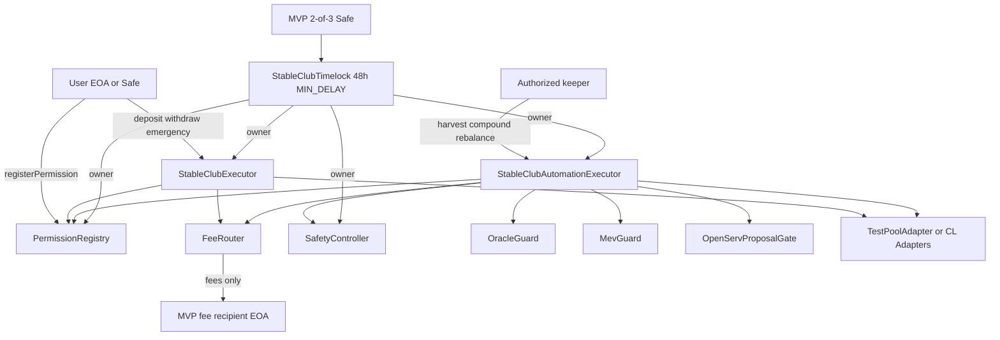

# Stable Club — AI Command Center Audit Context

> **Read-only audit source.** This branch documents the frozen implementation for professional / AI-assisted review.  
> **Do not treat UI screenshots or marketing copy as proof of on-chain behavior.**

## Audit scope and objectives

**In scope**

- Smart contracts under `contracts/stable-club/` (production + test-only mocks)
- TypeScript integration layer `src/lib/stable-club/`
- Dev-gated frontend `src/app/app/stable-club/` and `src/components/stable-club/`
- Hardhat tests `test/stable-club/`, Vitest tests in `src/lib/stable-club/*.test.ts`
- Playwright Step 1 E2E `tests/e2e/stable-club.spec.ts` (+ helpers)
- Deployment / inspection scripts `scripts/stable-club/`
- Architecture and Step 3 documentation `docs/stable-club/`
- Governance, Permit2, oracle, and launch-parameter modules referenced by contracts

**Objectives**

1. Verify non-custodial architecture: user-owned LP NFTs, bounded permissions, no unrestricted executor authority
2. Verify fee logic (1% swap gross floor), MEV/oracle guards, and automation safety controls
3. Verify governance model: 2-of-3 Safe → 48h Timelock → protocol owners; emergency pause vs delayed unpause
4. Verify Permit2 dual-spender deposit path and canonical Base Permit2 enforcement
5. Identify gaps between **implemented contracts** vs **UI-only / mocked** product surfaces
6. Assess readiness for Stage 1 private beta (single pool, automation disabled)

**Out of scope (explicit exclusions)**

- INDEXLA marketplace, degen-club, creator dashboard (rest of IndexlaApp)
- indexla.tech marketing site (separate repo)
- Mainnet deployment verification (no protocol contracts deployed at freeze)
- Professional audit firm engagement / legal / regulatory
- APY / IL / rewards services (not implemented)
- Cross-chain / Ethereum implementations
- User funds on live Base mainnet (none authorized at freeze)

---

## Frozen baseline

| Field | Value |
|-------|-------|
| Repository | https://github.com/IdeatorYas/IndexlaApp |
| Branch | `audit/stable-club-command-center` |
| Frozen tag | `audit-freeze/stable-club-step3-904c4c5` |
| Frozen commit | `904c4c586565841999325646e6746050b04717b0` |
| Short SHA | `904c4c5` |
| Freeze message | Step 3 governance, Permit2, pre-audit hardening; Bugbot 4/4 resolved |

**Policy:** Do not modify frozen contract bytecode or behavior on this branch except audit documentation. Any code fix requires a new freeze tag and re-audit.

---

## Architecture overview



**Trust boundaries**

- Users retain LP NFT custody; executor never holds LP long-term (zero-balance invariant tested)
- Executors are operators on `PermissionRegistry`, not permission owners
- Fee recipient receives swap fees only — never protocol admin
- OpenServ proposes; it does not execute arbitrary calldata
- Production admin must be Timelock, not EOA (`mvp-governance.ts`, `production-guards.ts`)

---

## Requirements and intended behavior

Source documents (priority order):

1. `docs/stable-club/ENGINEERING_BIBLE.md` — product requirements (not all implemented)
2. `docs/stable-club/step3/02-governance-multisig-timelock.md`
3. `docs/stable-club/step3/09-pre-audit-hardening.md`
4. `src/lib/stable-club/launch-params.ts` — Stage 1 private beta params
5. `src/lib/stable-club/stage1-launch.ts` — single pool `USDC-cbBTC-UNI-005`

**Stage 1 intentional limitations**

- One official pool: `USDC-cbBTC-UNI-005` on Base Uniswap V3 0.05%
- Automation flags all `false` (`harvestEnabled`, `compoundEnabled`, `rebalanceEnabled`)
- USD caps in `launch-params.ts` are **off-chain docs/UI only** (`capsUsd` — on-chain encoding deferred)
- Aerodrome CL100 catalogue entries marked `unavailable-factory-missing` — must not silently remap
- Route `/app/stable-club` returns 404 unless `STABLE_CLUB_DEV_ENABLED=true`

---

## Code / document / test inventory

### Production smart contracts (11)

| Contract | Path |
|----------|------|
| PermissionRegistry | `contracts/stable-club/PermissionRegistry.sol` |
| StableClubExecutor | `contracts/stable-club/StableClubExecutor.sol` |
| StableClubAutomationExecutor | `contracts/stable-club/StableClubAutomationExecutor.sol` |
| FeeRouter | `contracts/stable-club/FeeRouter.sol` |
| SafetyController | `contracts/stable-club/SafetyController.sol` |
| OracleGuard | `contracts/stable-club/OracleGuard.sol` |
| MevGuard | `contracts/stable-club/MevGuard.sol` |
| OpenServProposalGate | `contracts/stable-club/OpenServProposalGate.sol` |
| StableClubTimelock | `contracts/stable-club/governance/StableClubTimelock.sol` |
| UniswapV3Adapter | `contracts/stable-club/adapters/UniswapV3Adapter.sol` |
| AerodromeSlipstreamAdapter | `contracts/stable-club/adapters/AerodromeSlipstreamAdapter.sol` |

### Libraries & interfaces

- `contracts/stable-club/libraries/` — UserTokenPull, ClNpmPositionValue, LiquidityAmounts, TickMath, FullMath, FixedPoint96
- `contracts/stable-club/interfaces/` — IAllowanceTransfer, IFeeRouter, IOracleGuard, ISafetyController, IStableClubAdapter, IConcentratedLiquidityAdapter

### Test-only contracts (10)

- `contracts/stable-club/test-only/` — MockPermit2, TestPoolAdapter, MockTwoOfThreeSafe, etc.

### TypeScript (`src/lib/stable-club/` — 32 files)

Includes: `abis.ts`, `permissions.ts`, `permission-id.ts`, `permit2.ts`, `production-guards.ts`, `launch-params.ts`, `mvp-governance.ts`, `official-pools.ts`, `oracle-config.ts`, `openserv.ts`, `positions.ts`, `verified-base-addresses.ts`, and `*.test.ts` modules.

### Frontend

| Path | Files |
|------|-------|
| Page | `src/app/app/stable-club/page.tsx` |
| Components | `src/components/stable-club/` (5 files) |
| Wallet | `src/components/wallet/StableClubWalletProvider.tsx` |
| API | `src/app/api/stable-club/deployments/route.ts`, `e2e/rpc/route.ts`, `e2e/send-tx/route.ts` |

### Scripts

| Script | Purpose |
|--------|---------|
| `scripts/stable-club/deploy-local.cjs` | Local Hardhat stack deploy |
| `scripts/stable-club/inspect-official-pools.cjs` | Base fork pool/oracle inspection |
| `scripts/stable-club/measure-gas-ceiling.cjs` | Gas ceiling evidence |

### Hardhat tests (14 files, ~106 cases)

- `test/stable-club/StableClubStep1.test.cjs`
- `test/stable-club/StableClubStep2.test.cjs`
- `test/stable-club/StableClubStep3*.test.cjs` (Governance, Permit2, Oracle, Timelock, ForkRehearsal, Prep, MvpGovernance)
- `test/stable-club/StableClubSecurityRemediation.test.cjs`
- `test/stable-club/StableClubBugbotRemediation.test.cjs`
- `test/stable-club/StableClubMevOracleHardening.test.cjs`
- `test/stable-club/StableClubPoolIdentity.test.cjs`
- `test/stable-club/StableClubBaseForkIntegration.test.cjs`

### Vitest (10 files, ~62 cases)

- `src/lib/stable-club/*.test.ts` — governance, permit2, permissions, launch-params, mvp-governance, deployments, step2, nft-approval, oracle-safe-hardening

### E2E

- `tests/e2e/stable-club.spec.ts`
- `tests/e2e/helpers/stable-club-inject-wallet.ts`
- `tests/e2e/stable-club-global-setup.cjs`, `stable-club-global-teardown.cjs`
- `playwright.stable-club.config.ts`

### Documentation

- `docs/stable-club/ENGINEERING_BIBLE.md`
- `docs/stable-club/stable-club-action-plan-and-pools.md`
- `docs/stable-club/step3/` — complete Step 3 pack (00–13, JSON artifacts)
- `docs/stable-club/DEVELOPMENT_STATUS_2026-08-28.md` — snapshot status report
- `docs/stable-club/COMMAND_CENTER_AUDIT_CONTEXT.md` — this file

### Configuration

- `hardhat.config.cjs` — Solidity 0.8.24, tests path `./test/stable-club`, chainId 8453
- `package.json` — `node:local`, `deploy:stable-club:local`, `test:contracts`, `test:e2e:stable-club`
- `.env.example` — variable **names** only (no secrets committed)

---

## Local test commands

From repository root (Node 20+, `npm ci`):

```bash
# Contracts
npm run compile:contracts
npm run test:contracts          # Hardhat — expect ~106 passing at 904c4c5

# TypeScript unit tests
npm run test                    # Vitest — expect ~130 passing (whole app; ~62 Stable Club)

# Local stack + E2E (optional)
npm run node:local              # Hardhat :8545
npm run deploy:stable-club:local
STABLE_CLUB_DEV_ENABLED=true NEXT_PUBLIC_STABLE_CLUB_DEV_ENABLED=true npm run dev
npm run test:e2e:stable-club

# Base fork tests (requires BASE_RPC_URL in .env.local — not committed)
BASE_RPC_URL=<your_rpc> npm run test:contracts
```

**Last verified at freeze commit `904c4c5`**

| Suite | Result |
|-------|--------|
| Hardhat (full) | **106 passing** (incl. fuzz/invariant + Base-fork conditional) |
| Vitest (full app) | **130 passing** |
| typecheck / lint / build | pass at freeze (1 pre-existing lint warning in unrelated file) |

---

## Known mocked / UI-only features

| Feature | Evidence | Auditor note |
|---------|----------|--------------|
| Position dashboard | `src/lib/stable-club/positions.ts` `buildIllustrativePositions()` — `dataVerifiedOnChain: false` | Displayed balances/fees are not chain-derived |
| Pool activation | `StableClubView.tsx` — React state only | Does not call on-chain activation |
| OpenServ proposals | `src/lib/stable-club/openserv.ts` in-memory | Not connected to keeper execution |
| Permit2 approvals panel | `StableClubApprovalsPanel.tsx` — text preview | No wallet transactions |
| Step 1 UI deposit path | `useStableClubExecution.ts` — legacy ERC20 approve | Permit2 dual-spender tested in Hardhat, not UI |
| APY / IL / rewards | Not implemented | Bible doc describes future behavior |

**Explicit instruction:** UI presence does **not** prove functionality. Verify against contracts, tests, and deployment manifests.

---

## Missing integrations

- Mainnet protocol deployment (registry, executors, timelock on Base)
- Indexer / subgraph for live positions
- Frontend harvest / compound / rebalance transactions
- Permit2 deposit path in UI
- On-chain USD cap encoding
- APY / fee APY / reward APY services
- OpenServ → automation executor keeper pipeline
- Testnet deployment scripts

---

## Security assumptions and trust boundaries

**Assumed trusted (configure at deploy)**

- MVP 2-of-3 Safe signers (`mvp-governance.ts` — public addresses only)
- Timelock delay ≥ 48h (`StableClubTimelock.MIN_DELAY`)
- Chainlink oracle feeds listed in `verified-base-addresses.ts`
- Canonical Base Permit2 `0x000000000022D473030F116dDEE9F6B43aC78BA3`
- Fee recipient EOA receives fees only

**Must not be trusted**

- OpenServ proposal content (validated + rate-limited, no arbitrary execution)
- Off-chain UI state (activation, illustrative positions)
- Keeper-supplied quotes without MevGuard / OracleGuard bands

**User authorization model**

- Scoped permissions with expiry, caps, slippage, nonces (`PermissionRegistry.sol`)
- User can revoke/pause; emergency exit allowed when paused (not when revoked/expired)
- LP NFT `approve(adapter, tokenId)` required per position (no `setApprovalForAll` in product path)

---

## Deployment status (at freeze)

| Item | Status |
|------|--------|
| Protocol on Base mainnet | **Not deployed** |
| Timelock address | `null` in `mvp-governance.ts` |
| Governance Safe | Verified on Base `0x356A4A432EE57F31F5cF8Fdd55F95c1FF6Cd5910` |
| Fee recipient | `0x9d269f7A3d3f781740081D35F086D68a4a21442D` |
| Local deployments | `src/lib/stable-club/generated/local-deployments.example.json` (zeros); runtime JSON not committed |
| Production app | Stable Club route hidden (`STABLE_CLUB_DEV_ENABLED=false` default) |
| Audit freeze tag | `audit-freeze/stable-club-step3-904c4c5` |

---

## Known blockers (pre-launch)

1. Professional smart-contract audit not started
2. Mainnet deploy + Timelock ownership wiring not authorized
3. Frontend not wired to real pools / automation / Permit2 on mainnet
4. No indexer for position truth
5. `codeFreezeBlockers()` strings partially stale vs post-freeze state (doc/test debt — see status report)

---

## Audit output format (required)

Classify every finding:

| Severity | Definition |
|----------|------------|
| **Critical** | Direct loss of user funds, permanent lock, or governance takeover |
| **High** | Significant fund risk or broken core invariant under realistic conditions |
| **Medium** | Material bug with mitigations or limited blast radius |
| **Low** | Minor logic/UI/docs issue, defense-in-depth |
| **Informational** | Best practice, gas, clarity, non-exploitable |

**Each finding MUST include**

1. Severity
2. Title
3. Exact file path(s) and function / line reference
4. Evidence (code snippet, test gap, or trace)
5. Impact
6. Recommendation
7. Stage 1 relevance (in scope / excluded / intentional limitation)

---

## AI Command Center connection instructions

1. Open **IdeatorYas/IndexlaApp** in the AI Command Center (or connect GitHub repo).
2. Select branch: **`audit/stable-club-command-center`** (not `main`).
3. Set context root to **`docs/stable-club/COMMAND_CENTER_AUDIT_CONTEXT.md`**.
4. Pin frozen reference: tag **`audit-freeze/stable-club-step3-904c4c5`**, commit **`904c4c5`**.
5. Primary review paths:
   - `contracts/stable-club/`
   - `test/stable-club/`
   - `src/lib/stable-club/production-guards.ts`, `permit2.ts`, `launch-params.ts`
6. Cross-check UI claims against **`DEVELOPMENT_STATUS_2026-08-28.md`** mocked-feature table.
7. Do **not** use production URLs or `.env` files — none are included in this branch’s audit docs.

---

*Generated for Command Center audit prep. Implementation frozen at `904c4c5`; this file is audit metadata only.*
